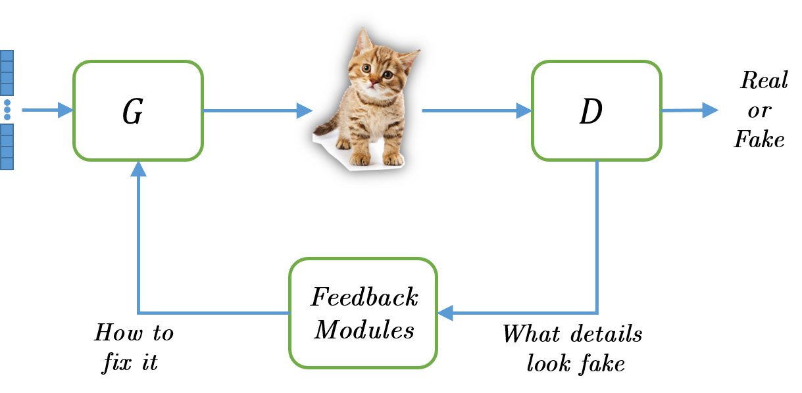
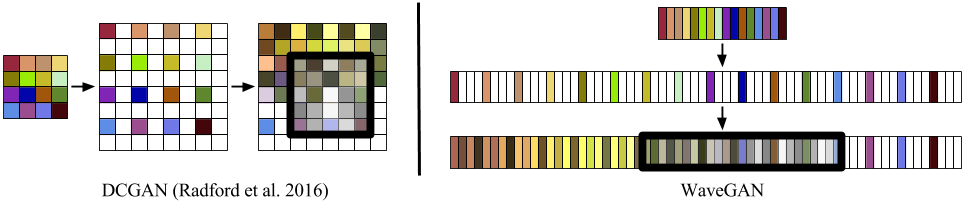

# Examining The Effects of Adding Adversarial Feedback Loop to WaveGAN

Classic GAN is composed of two components: the generator (G) and the discriminator (D). In this setting, the information flow is
done purely by back-propagation, during training. Firas Shama, Roey Mechrez, Alon Shoshan & Lihi Zelnik-Manor proposed adding a third component – a feedback module that transmits the discriminatory spatial information to the generator in a feedback manner at inference time. This proved to substantially improve the quality of GANs in image generation tasks like face generation and super-resolution. [<b>[project page]</b>](https://cgm.technion.ac.il/Computer-Graphics-Multimedia/Software/AFL/)

&nbsp;

  <b>The Adversarial Feedback Loop</b> 

&nbsp;
&nbsp;

Essentially, this feedback module could be added to a pre-trained GAN, and with very little additional training of the feedback module, improve its results. I decided to examine the effects of adding the feedback module to WaveGAN, a GAN that synthesizes raw waveform audio after observing many examples of real audio. [<b>[project page]</b>](https://github.com/chrisdonahue/wavegan)

Aside from my aspiration to learn about GANs and an interest in audio generation, it is interesting to see how meaningful the effect of adding the feedback module would be in a different domain (i.e., not images).

## TODO
Still in progress.

- [x] Add feedback module to WaveGAN.
- [x] Figure out how to load pretrained model in tensorflow to a changed graph.
- [ ] Compare Inception score & audio quality for sc09.
- [ ] Compare audio quality for piano noises.
